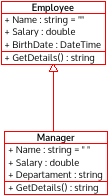
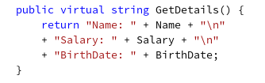
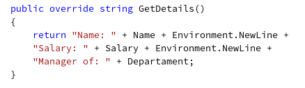
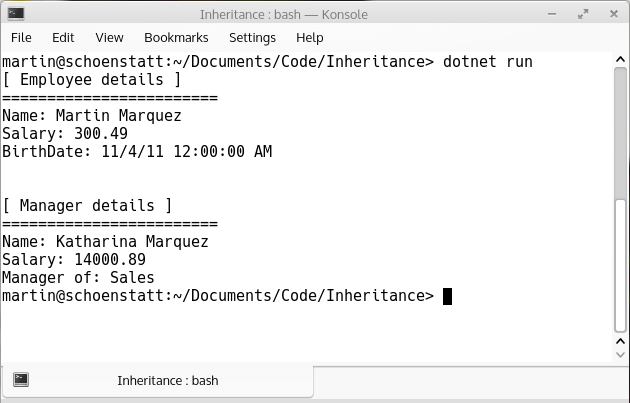

# Overriding Methods in C#
    

      In addition to producing a new class based on an old one by adding additional features, you can modify existing behavior of the parent class.
    

    

      If a method is defined in a derived class so that the name, return type, and argument list match exactly those of a method in the parent class, then the new method is said to override the old one.
    

    <h3>The keyword virtual</h3>
    

      In C#, a class can declare virtual methods, properties, and indexers, and derived classes can override the implementation of these function members. 
    

    

      The keyword <b>virtual</b> allows programmers to specify methods that a derived class can override, C# methods are non-virtual by default and must be explicitly declared as virtual.
    

    

      The implementation of a non-virtual method is invariant: The implementation is the same whether the method is invoked on an instance of the class in which it is declared or an instance of derived class. In contrast, the implementation of a virtual method can be changed by derived classes.
    

    <h3>The keyword override</h3>
    

      To override a base-class method definition, a derived class must specify that the derived-class method overrides the base-class method with keyword <b>override</b> in the method header.
    

    

      If the override modifier is not used, the new member hides the inherited member, and a compiler warning occurs. If a derived class attempts to override a non-virtual inherited member, a compiler error will occur.
      The following examples illustrate the using of <b>virtual</b> and <b>override</b> keywords.
    

    
<b>Fig 1. Class diagram for Employee and Manager using Inheritance.</b>
 

 

Consider these sample methods in the <i>Employee</i> and <i>Manager</i> classes:

    
<b>Fig 2. The GetDetails method of the Employee class.</b>
 

 
    
<b>Fig 3. The GetDetails method of the Manager class.</b>
 

 

  The Manager class has a GetDetails method by definition because it inherits one from the Employee class. However, the original method has been replaced, or overridden, by the derived class’s version.

<b>Fig 4 The output of executing this program is the following.</b>
 

 
